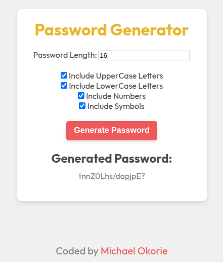

# Password Generator

A fully functional and customizable **random password generator** built with **vanilla JavaScript**.  
Users can choose password length, toggle character types, and instantly generate strong, secure passwords — no libraries, no fluff, just logic and DOM control

---

## Screenshot



---

## Live Demo

[Live Site](https://michael-okorie.github.io/Password-Generator/)  
[GitHub Repo](https://github.com/Michael-Okorie/Password-Generator.git)

---

## Features

- Adjustable password length (min: 4, max: 20)
- Toggle options for:
  - Lowercase letters
  - Uppercase letters
  - Numbers
  - Symbols
- Instant password generation
- Easy to copy
- Strong, random passwords every time

---

## Built With

- HTML5
- CSS3
- JavaScript (ES6)
- _No frameworks. No dependencies._

---

## What I Learned

This project pushed me to:
- Understand checkbox inputs and `.checked` logic
- Handle multiple user inputs through the DOM
- Build character pools dynamically
- Manage `Math.random()` effectively with strings
- Respect the difference between frustration and failure — because **I didn’t quit.**

---

## Code Highlights

```js
const value = Math.floor(Math.random() * allowedChars.length);
generatedPassword += allowedChars[value];
```

## Author

- GitHub – [@Michael-Okorie](https://github.com/Michael-Okorie)
- Twitter – [@Dev_Michael_](https://x.com/Dev_Michael_)
- Frontend Mentor – [@Michael-Okorie](https://www.frontendmentor.io/profile/Michael-Okorie)

---

## Acknowledgments

Shout out to the devs who build in public, share their pain, and keep showing up.  
Special love to the JS community, and to [@BroCode](https://www.youtube.com/@BroCodez) for his straightforward breakdowns.  
This one was tough — and that’s why it feels **so damn good** to ship.
